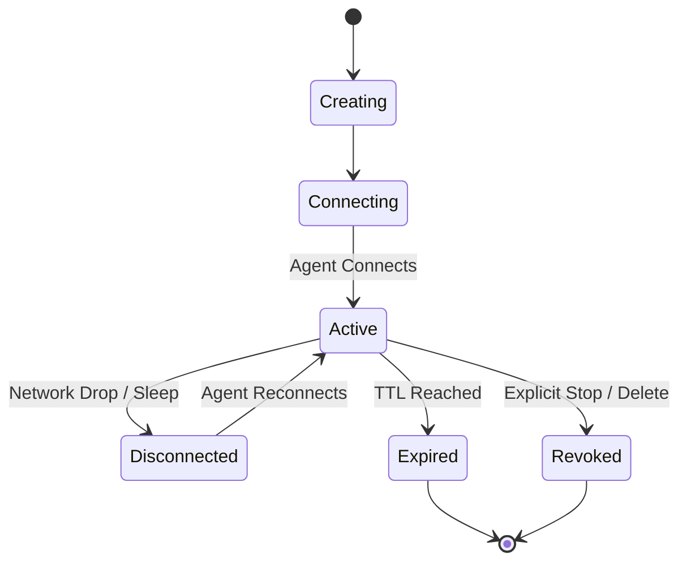

Outpipe cleanly separates **control-plane management** from **data-plane traffic forwarding**:

- **Tunnel (Control Plane)**: A durable database entity that defines an owner organization, protocol, public routing hostname, password protection rules, and usage policies.
- **Session (Data Plane)**: The live, active WebSocket connection established between your local agent/client and the nearest Outpipe relay node.

This decoupled architecture allows you to stop and restart local processes without losing your assigned subdomain or custom domain configuration.

## Supported Protocols

Outpipe supports all major transport and application protocols:

| Protocol | Description | Local Example | Public Access |
| :--- | :--- | :--- | :--- |
| **HTTP** | Proxies HTTP/1.1 and HTTP/2 web requests, APIs, and webhooks. | `http://localhost:3000` | `https://<subdomain>.outpipe.app` |
| **HTTPS** | Connects to local TLS services with optional certificate verification. | `https://localhost:8443` | `https://<subdomain>.outpipe.app` |
| **WebSockets** | Automatically supports bidirectional `ws://` and `wss://` upgrades over HTTP routes. | `ws://localhost:3000/socket` | `wss://<subdomain>.outpipe.app/socket` |
| **TCP** | Forwards raw binary TCP streams (databases, SSH, game servers) with dedicated public port allocation. | `127.0.0.1:5432` | `relay.outpipe.app:<assigned_port>` |
| **UDP** | Forwards low-latency UDP datagrams with buffer tracking and source address preservation. | `127.0.0.1:5353` | `relay.outpipe.app:<assigned_port>` |

## Tunnel Lifecycle States

- `creating`: The tunnel resource has been registered in the database, awaiting an agent connection.
- `connecting`: An agent has initiated a WebSocket upgrade with the relay and is performing the handshake.
- `active`: The tunnel is online, registered in the request router, and actively forwarding incoming requests.
- `disconnected`: The agent disconnected temporarily (e.g. laptop closed). The public hostname remains reserved during the inactivity grace window.
- `expired`: The tunnel TTL has elapsed.
- `revoked`: The tunnel was explicitly stopped or deleted by the user, immediately releasing the public hostname and ports.
